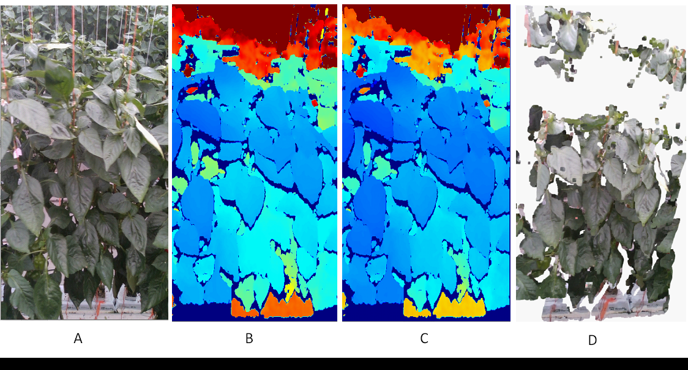

# RGBD Processing
## Setup python environment

Create conda environment or python virtual environment with following packages. The project is tested with a canda environment with python 3.8.
```
cv2, numpy, shutil, open3d, json, sklearn, pyrealsense2
```

## Download data

Download the Rosbagfilr(.bag) and Json file that contains metadata that wanted to process. Move both .bag file and .json file to path "data/bag_files" under the project root.
link for downloading data will be updated here soon.

## Extract image frames

Extracting the image data of the downloaded bag file, supports extracting, color images, depth images, depth scale, and camera intrinsic parameters.
parameters  for cropping series and number frames to extracted can be set in the json file with the same file name as the corresponding .bag file. To set different start and end of frames to be extracted, .rosbag can be played using Realsense viewer software and manually identify the corresponding frame numbers in image frame information.
In the image frame extraction code, a few post-processing filters: decimationa, spacial, and temporal filters from pyrealsense library has been applied. The RGB images are saved as .jpg files and depth images are saved as .png files by preserving the actual depth values which are 16-bit integers.

Steps:
1. Set the filename of downloaded filename (without file extention) to "load_rosbag" function call under the main method of extract_frame.py
2. Change the image frame extraction parameters in the corresponding Json file if needed.
3. Run the "extract_frame.py" python script. 

File can be run using terminal as follows:

Open terminal/powershell and change current dirrect to project root
```
cd src
python extract_frame.py
```

## Process and Visualise data

We provide loading extracted images, correcting depth error, and generating 3d scene.
Depth error correction is done using a regression model which built using another collected small data set. See the relavant bublication for more informations.
Following image shows example of per frame visualization that we provided:- A: color image, B:depth image, C: corrected depth image, D: reconstructed 3D scene.




#### Downlad Data [here](to update)

#### Cite Us:
```
@article{jayasuriya2024pc4c_capsi,
  title={PC4C_CAPSI: Image Data of Capsicum plant growth in Protected Horticulture},
  author={Jayasuriya, Namal and Guo, Yi and Hu, Wen and Ghannoum, Oula and Others},
  journal={Data in Brief},
  volume={},
  pages={},
  year={2024},
  publisher={Elsevier}
}
```

#### Related Publication:
Jayasuriya, N.; Guo, Y.; Hu, W.; Ghannoum, O. Machine Vision Based Plant Height Estimation for Protected Crop Facilities. Computers and Electronics in Agriculture 2024, 218, 108669, doi:10.1016/j.compag.2024.108669.
